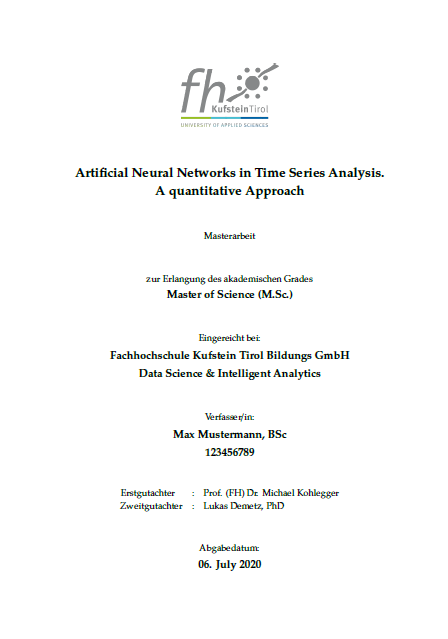
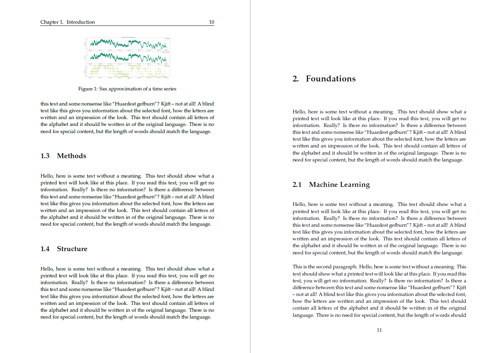

# LaTeX Vorlage für Masterarbeiten

- [LaTeX Vorlage für Masterarbeiten](#latex-vorlage-f%C3%BCr-masterarbeiten)
  - [Einstellungen zu Typ, Studiengang und Sprache](#einstellungen-zu-typ-studiengang-und-sprache)
  - [Kapitel](#kapitel)
  - [Anhänge](#anh%C3%A4nge)
  - [Custom Commands](#custom-commands)
  - [Tabellen](#tabellen)
  - [Sourcecode Listings](#sourcecode-listings)
  - [LaTeX Editor](#latex-editor)
  - [Ausführen](#ausf%C3%BChren)




Diese Vorlage entspricht allen Vorgaben des "Leitfadens für Masterarbeiten an der FH Kufstein Tirol". Alle **erforderlichen Einstellungen** können in den Files

* **[`document.tex`](document.tex)**: Dieses File enthält die Struktur der Arbeit und erlaubt das Einstellen der Sprache der Arbeit.
* **[`variables.tex`](variables.tex)**: Dieses File enthält alle persönlichen Eigenschaften, z.B. Name des Autors, GutachterInnen, Titel usw. wie auch Variablen für die Arbeit selbst, etwa Sprache und Typ.

## Einstellungen zu Typ, Studiengang und Sprache
Um den Typ der Arbeit (Bachelorarbeit bzw. Masterarbeit) bzw. den Studiengang einzustellen, müssen in der [`variables.tex`](variables.tex) die beiden Variablen `type` bzw. `program` angepasst werden. Mögliche Werte für `type` sind `BA` für Bachelorarbeiten bzw. `MA` für Masterarbeiten. Für `program` sind die Werte `DSIA` für Data Science & Intelligent Analytics, `WEB` für Web Business & Technology bzw. `WCIS` für Web Communications & Information Systems erlaubt.

Die Sprache, in der die Arbeit geschrieben wird, lässt sich über die Variable `lang` einstellen. Mögliche Sprachen sind Deutsch (`DE`) und Englisch (`EN`).

## Kapitel

Im Template wurden bereits einige, gängige Beispielkapitel eingefügt. Diese finden sich im Ordner **[`chapters`](chapters)**. Natürlich können jederzeit weitere Kapitel in die Arbeit eingefügt werden. Hierzu wird z.B. ein neues File im Ordner [`chapters`](chapters) angelegt. Anschließend muss dieses im File [`document.tex`](document.tex) referenziert werden.

## Anhänge

Im Template werden ebenfalls bereits exemplarische Anhänge (Appendices) verwendet. Die entsprechenden Files befinden sich im Ordner **[`appendix`](appendix)** und werden, analog zu den Kapiteln, im File [`document.tex`](document.tex) eingebunden.

## Custom Commands

Wir haben mit [`commands.tex`](commands.tex) eine Möglichkeit vorgesehen, eigene LaTeX-Befehle zu erstellen. Im File wurden bereits zwei exemplarische Commands angelegt - `\fh` (zum einfachen Einbinden des FH-Schriftzugs) und `\fig` (zum einfachen Einfügen von Bildern mit Bildbeschriftungen). Diese Befehle folgen der herkömmlichen Syntax von LaTeX. 

Mit Hilfe der `\fig`-Sequenz lassen sich z.B. Bilder wie folgt einfügen (das erste Attribut bezeichnet den Speicherort, das zweite Attribut die Bildbeschriftung, das dritte Attribut das Label für etwaige Referenzen, und das vierte Attribut die Bildbreite in Relation zur Textbreite):

```latex
\fig{img/sax_approximated_series}{Sax approximation of a time series}{fig:sax}{0.5}
```

Dieser Command wurde in [`commands.tex`](commands.tex) mit Hilfe folgender Spezifikation angelegt:

```latex
\newcommand{\fig}[4]{
    \begin{figure}[ht]
        \centering
        \includegraphics[width=#4\textwidth]{#1}
        \caption{#2}
        \label{#3}
    \end{figure}
}
```

Auf ähnliche Weise können weitere, benutzerdefinierte Befehle angelegt werden.

## Tabellen

Für Tabellen sollte das [`booktabs`](https://ctan.org/pkg/booktabs?lang=de) Paket verwendet werden. Eine Tabelle könnte wie folgt aussehen:

```latex
\begin{table}[htbp]
    \centering
    \caption{This is a table}
    \label{tab:table-one}
    \begin{tabular}{lll}
        \addlinespace
        \toprule
        Column 1 & Column 2 & Column 3 \\
        \midrule
        A     & B     & C \\
        D     & E     & F \\
        G     & H     & I \\
        \bottomrule
    \end{tabular}
\end{table}
```

Da die Arbeit mit Tabellen in LaTeX durchaus kompliziert werden kann, empfiehlt sich das Excel Plugin [Excel2LaTeX](https://www.heise.de/download/product/excel2latex-66332) bzw. ein online Editor z.B. http://excel2latex.com/.

## Sourcecode Listings

Zum Einbinden von Sourcecode können wir das [`listings`](https://ctan.org/pkg/listings) Paket verwenden. Das Einbinden von Sourcecode könnte wie folgt aussehen:

```latex
\begin{lstlisting}[language=Java, caption=Hello World in Java, label=lst:hello-world-java]
    public class Hello {
        public static void main(String[] args) {
            System.out.println("Hello World");
        }
    }
\end{lstlisting}
```

Sourcecode kann aber auch direkt aus einer Datei eingebunden werden. Dazu kann der `\lstinputlisting` Befehl verwendet werden, also z.B.

```latex
\lstinputlisting[language=Python, caption=Hello World in JavaScript, label=lst:hello-world-py]{./lst/hello.py}
```

wenn wir die Datei `hello.py` aus dem `lst` Ordner einbinden wollen.

## LaTeX Editor

Dieses Template wurde mit Visual Studio Code, der [LaTeX Workshop](https://marketplace.visualstudio.com/items?itemName=James-Yu.latex-workshop) Erweiterung und [MiKTeX](https://miktex.org/download) (2.9) erstellt. Alle verwendeten Pakete können über den Paketmanager von MiKTeX bezogen werden.

Das Projekt wurde außerdem mit [Overleaf](https://www.overleaf.com) getestet. Das [Gitlab-ZIP-Archiv](https://gitlab.web.fh-kufstein.ac.at/kohleggermichael/WEBTA_latex_template/-/archive/master/WEBTA_latex_template-master.zip) dieses Projekts kann in Overleaf direkt als neues Projekt importiert werden und ist anschließend sofort lauffähig.

## Ausführen

Damit alle Verweise und Referenzen richtig im Dokument eingefügt werden, muss LaTeX und BibTeX mehrmals ausgeführt werden. Um diesen Vorgang zu vereinfachen, haben wir die beiden Scripts `make-latex.bat` für Windows bzw. `make-latex.sh` für Mac/Linux erstellt. Die Scripts verschieben auch alle temporären Dateien in den `tmp` Ordner.
